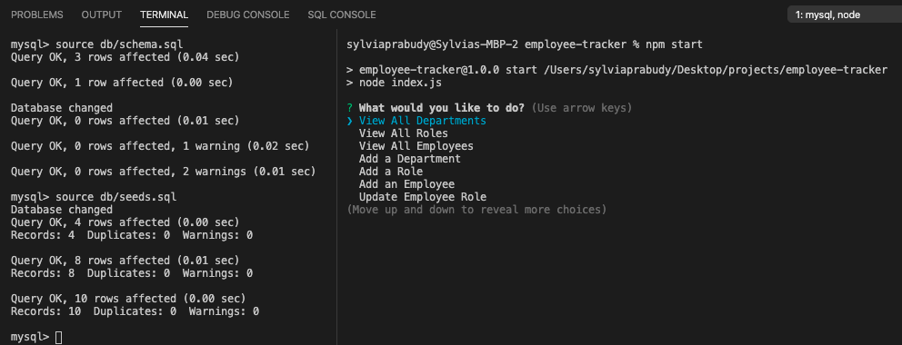
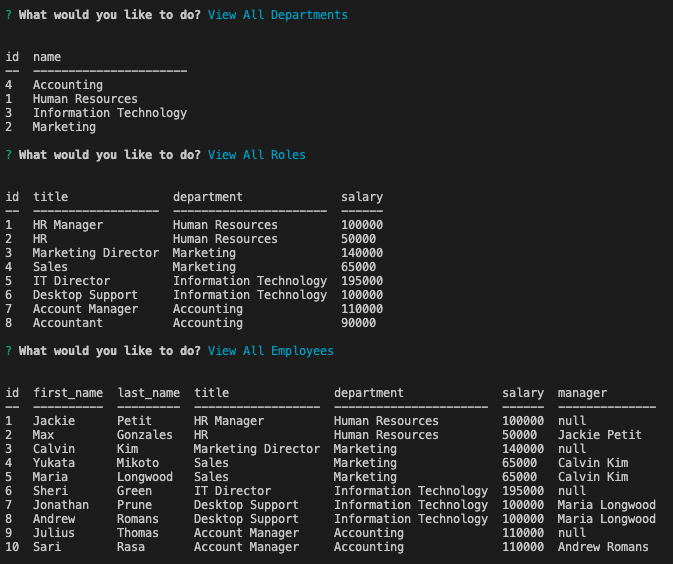
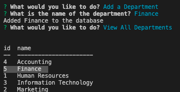
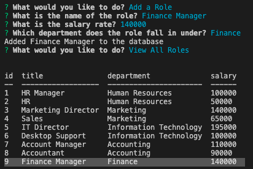
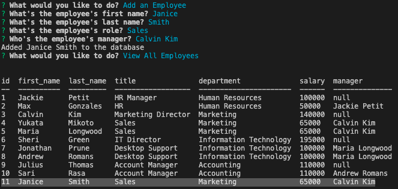

# employee-tracker

A command-line application to manage a company's employee database, using Node.js, Inquirer, and MySQL.

### Github : https://github.com/sylviaprabudy/employee-tracker

### Walkthrough video : https://drive.google.com/file/d/1nszLrXP6h6clwNgTbdWFpGmEilN6u8CY/view


## Description
A command-line application to manage a company's employee database, using Node.js, Inquirer, and MySQL.


## User Story
```
- AS A business owner
- I WANT to be able to view and manage the departments, roles, and employees in my company
- SO THAT I can organize and plan my business
```


## Usage
- Application will allow user to view all departments.
- Application will allow user to view all roles.
- Application will allow user to view all employees.
- Application will allow user to add a department.
- Application will allow user to add a role.
- Application will allow user to add an employee.
- Application will allow user to update an employee role.


## Screenshots







## Technologies Use
<p><a href="https://nodejs.org/">Node.js</a></p>
<p><a href="https://www.npmjs.com/">NPM</a></p>
<p><a href="https://dev.mysql.com">MySQL</a></p>
<p><a href="https://www.npmjs.com/package/inquirer">Inquirer.js</a></p>
<p><a href="https://www.npmjs.com/package/mysql2">Node MySQL 2</a></p>
<p><a href="https://www.npmjs.com/package/console.table">console.table</a></p>


## Contributor:
Sylvia Prabudy ©2020 All Rights Reserved.
- - -